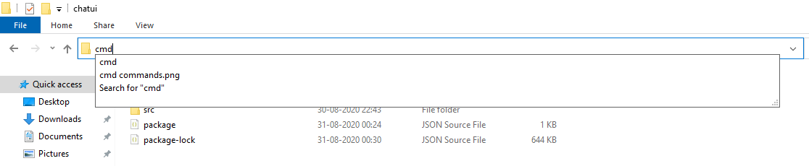
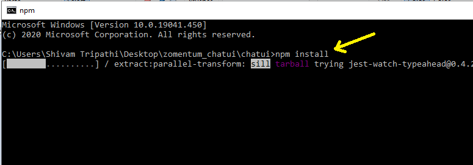
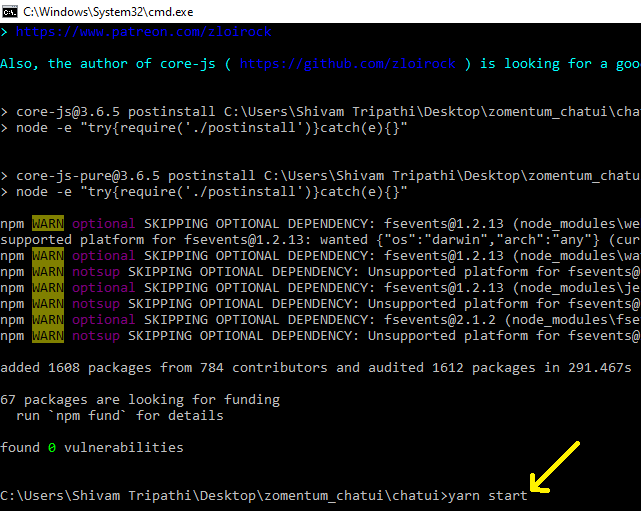
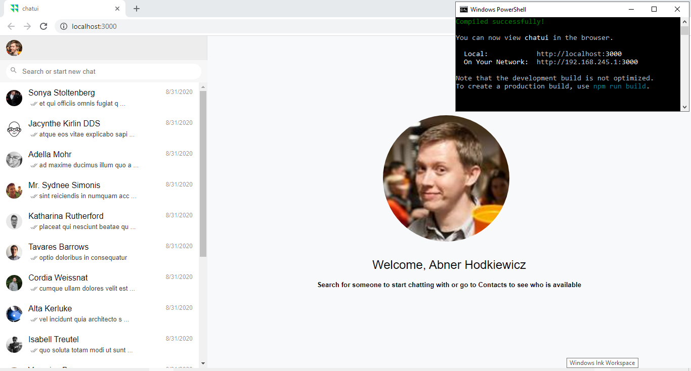
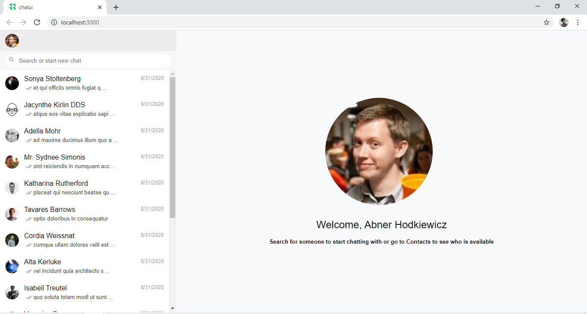
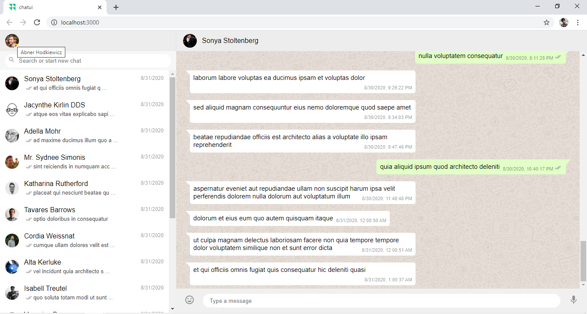
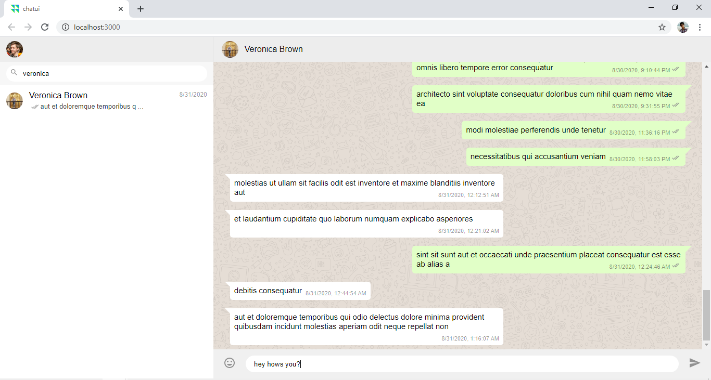
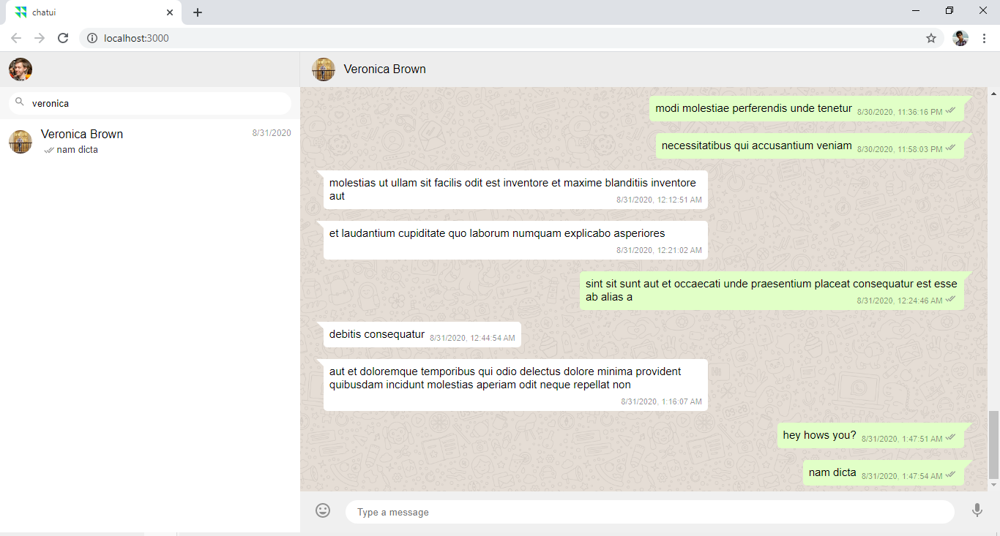
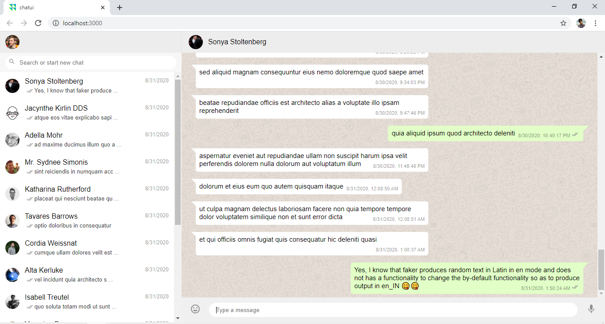

# zomentum_chatui
Frontend Problem Statement Hiring Assignment - UI for a chat application named chatui

---
 

### How to run the project?

##### 1. Download the project as a zip folder and extract it using extract here in the file options. 

##### 2. Open the folder "zomentum_chatu"i and then "chatui". Then type "cmd" in the address bar as below:

##### 3. Type and enter the command "npm install" to install the dependencies of the project

##### 4. After the dependencies gets installed, type and enter the command "yarn start" to start the local host

##### 5. The development server starts with a tab to view chatui in the browser at local "http://localhost:3000"

> To edit the project in visual code, one can type the command "code ." in cmd in place of step 3 and onwards.
> Software and Libarary Requirement: Reactjs, npx-npm, Nodejs, React Hooks, Visual Code with other dependencies like faker for text generation.
 

---

### Output Preview

##### 1. Welcome screen of the chatui named application

##### 2. Every contact component has its component for messages with its new state

##### 3. Search bar operation

##### 4. Message sent to a particular contact manually as well as clicking the mic button which generates and sends the random text using faker

##### 5. Manually written text gets appnended to the message component for that particular contact. Unicode of emojis are also supported within the message box.

 

---

## By:
#### SHIVAM TRIPATHI
##### JIIT Noida - Sector 62
---
[Back To The Top](#zomentum_chatui)
